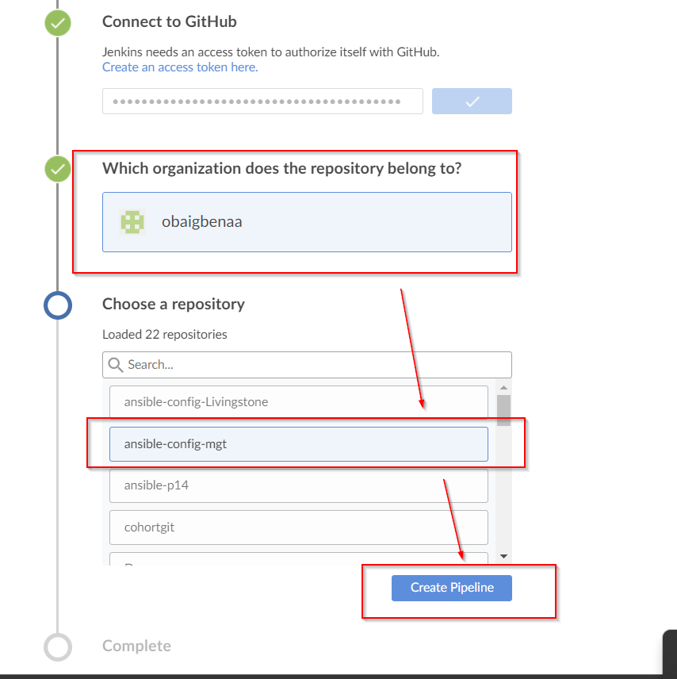
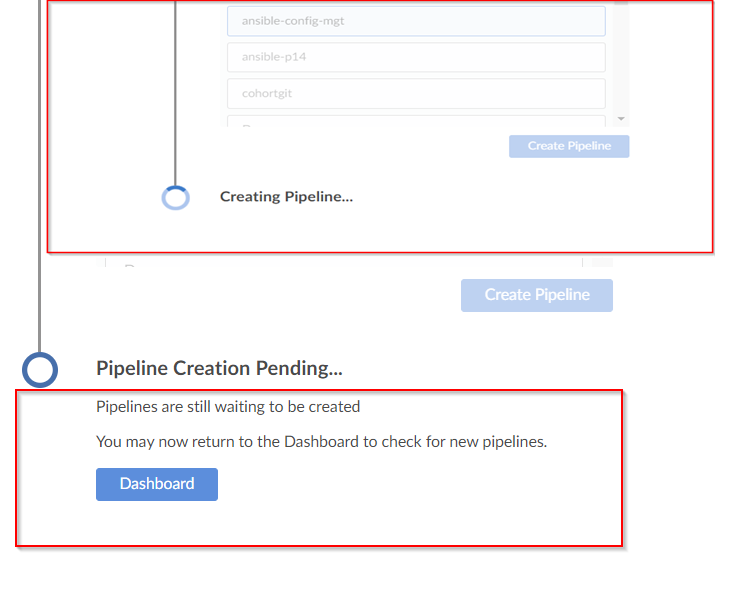
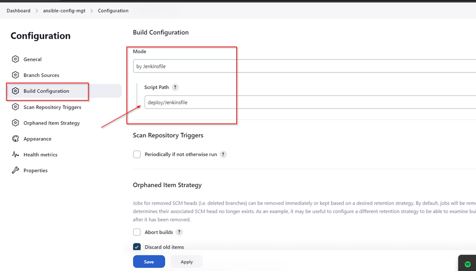

## Project-14

## CONTINUOUS INTEGRATION WITH JENKINS, ANSIBLE, ARTIFACTORY, SONARQUBE, PHP

## SIMULATING A TYPICAL CI/CD PIPELINE FOR A PHP BASED APPLICATION

**Project Description:**

In this project, we will be setting up a CI/CD Pipeline for a PHP based application. The overall CI/CD process looks like the architecture below:


This project is architected in two major repositories with each repository containing its own CI/CD pipeline written in a Jenkinsfile.

**“ansible-config-mgt” REPO**: this repository contains JenkinsFile which is responsible for setting up and configuring infrastructure required to carry out processes required for our application to run. It does this through the use of ansible roles. This repo is infrastructure specific.

**“PHP-todo REPO”:** this repository contains jenkinsfile which is focused on processes which are application build specific such as building, linting, static code analysis, push to artifact repository etc.


### Prerequisites

We will be making use of AWS virtual machines for this and will require 6 servers for the project which includes:

**Nginx Server:** This would act as the reverse proxy server to our site and tool.

**Jenkins server:** To be used to implement your CI/CD workflows or pipelines. Select a t2.medium at least, Ubuntu 20.04 and Security group should be open to port 8080

**SonarQube server:** To be used for Code quality analysis. Select a t2.medium at least, Ubuntu 20.04 and Security group should be open to port 9000

**Artifactory server:** To be used as the binary repository where the outcome of your build process is stored. Select a t2.medium at least and Security group should be open to port 8081

**Database server:** To server as the databse server for the Todo application

**Todo webserver:** To host the Todo web application.


### ANSIBLE ROLES FOR CI ENVIRONMENT

In addition to our already existing roles, we will go ahead and add two more roles to ansible:


1.	[SonarQube](https://www.sonarqube.org). (Scroll down to the Sonarqube section to see instructions on how to set up and configure SonarQube manually)
1. [Artifactory](https://jfrog.com/artifactory).

**Why do we need SonarQube?**

SonarQube is an open-source platform developed by SonarSource for continuous inspection of code quality, it is used to perform automatic reviews with static analysis of code to detect bugs, code smells, and security vulnerabilities. Watch a short description here. There is a lot more hands on work ahead with SonarQube and Jenkins. So, the purpose of SonarQube will be clearer to you very soon.

**Why do we need Artifactory?**

Artifactory is a product by JFrog that serves as a binary repository manager. The binary repository is a natural extension to the source code repository, in that the outcome of your build process is stored. It can be used for certain other automation, but we will it strictly to manage our build artifacts.

### Configuring Ansible for Jenkins Deployment

In previous projects, we have been launching Ansible commands manually from a CLI. Now, with Jenkins, we will start running Ansible from Jenkins user interface (UI).

To do this, navigate to Jenkins URL, Install & Open Blue Ocean Jenkins Plugin


*Create a new Pipeline*


*Login to GitHub & Generate an Access Token*







At this point we do not have a [Jenkinsfile](https://www.jenkins.io/doc/book/pipeline/jenkinsfile/) in the Ansible repository, so Blue Ocean will attempt to give us some guidance to create one. But we do not need that. We will rather create one ourselves. So, click on Administration (as seen above) to exit the Blue Ocean console.


We will see here, our newly created pipeline which takes the name of our GitHub repository **“ansible-config-mgt”.**


### We will now create our Jenkinsfile

Inside the Ansible project, create a new directory ***deploy*** and start a new file ***Jenkinsfile*** inside the directory.

Add the code snippet below to start building the Jenkinsfile gradually. 

This pipeline currently has just one stage called Build and the only thing we are doing is using the shell script module to echo Building Stage. 

```
pipeline {
    agent any

  stages {
    stage('Build') {
      steps {
        script {
          sh 'echo "Building Stage"'
        }
      }
    }
    }
}
```
Add and push to github.


Now we go back into the Ansible pipeline in Jenkins and select configure.




Click “Apply” and “Save”. This will trigger a build and we will be able to see the effect of our basic Jenkinsfile configuration by going through the console output of the build. Now you will see that a build takes place with success.


To really appreciate and feel the difference of Cloud Blue UI, it is recommended that we try triggering the build again from Blue Ocean interface.

1.	Click on **Blue Ocean**
1.	Select the project **“ansible-config-mgt”**


Notice that this pipeline is a multibranch one. This means, if there were more than one branch in GitHub, Jenkins would have scanned the repository to discover them all and we would have been able to trigger a build for each branch.

To see this in action,
1.	We will create a new git branch and name it ***feature/jenkinspipeline-stages***


2. Currently we only have the Build stage. We will add another stage called ***Test***. Paste the code snippet below and push the new changes to GitHub.

```
pipeline {
    agent any

  stages {
    stage('Build') {
      steps {
        script {
          sh 'echo "Building Stage"'
        }
      }
    }

    stage('Test') {
      steps {
        script {
          sh 'echo "Testing Stage"'
        }
      }
    }
    }
}

```
```
$ git add .
$ git commit -m "added test stage"
$ git push origin feature/jenkinspipeline-stages
```


To make your new branch show up in Jenkins, we need to tell Jenkins to scan the repository.

-	Click on the "Administration" button.
-	Navigate to the Ansible project and click on "Scan repository now"


-	Refresh the page and both branches will start building automatically. You can go into Blue Ocean and see both branches there too.


In Blue Ocean, you can now see how the Jenkinsfile has caused a new step in the pipeline launch build for the new branch.


Go to GitHub, create pull request, and merge to main branch.


 After merging the PR, go back into your terminal and switch into the main branch, pull the latest change.

 Following the same sequence above, we will create a new branch, add more stages into the Jenkins file to simulate below phases. (Just add an echo command like we have in build and test stages)
   1. Package 
   1. Deploy 
   1. Clean up

Dont forget we have to update the jenkinsfile for all stages.

When all stages are now created, it should look like below.


### RUNNING ANSIBLE PLAYBOOK FROM JENKINS

Now that we have a broad overview of a typical Jenkins pipeline. Let us get the actual Ansible deployment to work by:
-	Installing Ansible on Jenkins
-	Installing Ansible plugin in Jenkins UI
-	Creating Jenkinsfile from scratch. (Delete all currently in the jenkinsfile and start all over to get Ansible to run successfully). 

Ensure that Ansible runs against the Dev environment successfully.

*Install ansible plugin*


click on ***“configure tools”***, scroll down to and input any name of your choice on the ***“ansible Name”*** section,
input path to ansible name directory ***/usr/bin/*** (this can be gotten if run the command ansible -–version on the Jenkins instance CLI) 


Add the following code to the jenkinsfile

```
pipeline {
  agent any
  
  environment {
      ANSIBLE_CONFIG="${WORKSPACE}/deploy/ansible.cfg"
    }

  stages{
    stage("Initial cleanup") {
          steps {
            dir("${WORKSPACE}") {
              deleteDir()
            }
          }
        }

      stage('Checkout SCM') {
         steps{
            git branch: 'main', url: 'https://github.com/obaigbenaa/ansible-config-mgt.git'
         }
       }

      stage('Prepare Ansible For Execution') {
        steps {
          sh 'echo ${WORKSPACE}' 
          sh 'sed -i "3 a roles_path=${WORKSPACE}/roles" ${WORKSPACE}/deploy/ansible.cfg'  
        }
     }

      stage('Run Ansible playbook') {
        steps {
           ansiblePlaybook become: true, colorized: true, credentialsId: 'jenkins-key', disableHostKeyChecking: true, installation: 'ansible', inventory: 'inventory/dev.yml', playbook: 'playbooks/site.yml'
         }
      }

      stage('Clean Workspace after build'){
        steps{
          cleanWs(cleanWhenAborted: true, cleanWhenFailure: true, cleanWhenNotBuilt: true, cleanWhenUnstable: true, deleteDirs: true)
        }
      }
   }

}
```

**Some possible errors to watch out for:**

1. Ensure that the git module in Jenkinsfile is checking out SCM to *main* branch instead of *master* (GitHub has discontinued the use of *Master*)

1. Jenkins needs to export the ANSIBLE_CONFIG environment variable. You can put the *.ansible.cfg* file alongside Jenkinsfile in the deploy directory. This way, anyone can easily identify that everything in there relates to deployment. Then, using the ***Pipeline Syntax*** tool in Ansible, generate the syntax to create environment variables to set. Enter this into the *ancible.cfg* file

>ansible.cfg

```
timeout = 160
callback_whitelist = profile_tasks
log_path=~/ansible.log
host_key_checking = False
gathering = smart
ansible_python_interpreter=/usr/bin/python3
allow_world_readable_tmpfiles=true


[ssh_connection]
ssh_args = -o ControlMaster=auto -o ControlPersist=30m -o ControlPath=/tmp/ansible-ssh-%h-%p-%r -o ServerAliveInterval=60 -o ServerAliveCountMax=60 -o ForwardAgent=yes
```


3. Remember that ansible.cfg must be exported to environment variable so that Ansible knows where to find Roles. But because you will possibly run Jenkins from different git branches, the location of Ansible roles will change. Therefore, you must handle this dynamically. You can use Linux Stream Editor sed to update the section roles_path each time there is an execution. You may not have this issue if you run only from the main branch.

1. If you push new changes to Git so that Jenkins failure can be fixed. You might observe that your change may sometimes have no effect. Even though your change is the actual fix required. This can be because Jenkins did not download the latest code from GitHub. Ensure that you start the Jenkinsfile with a clean up step to always delete the previous workspace before running a new one. Sometimes you might need to login to the Jenkins Linux server to verify the files in the workspace to confirm that what you are actually expecting is there. Otherwise, you can spend hours trying to figure out why Jenkins is still failing, when you have pushed up possible changes to fix the error.

1. Another possible reason for Jenkins failure sometimes, is because you have indicated in the Jenkinsfile to check out the main git branch, and you are running a pipeline from another branch. So, always verify by logging onto the Jenkins box to check the workspace, and run *git branch* command to confirm that the branch you are expecting is there.

**Note:** We will note that since we are tring to run the playbook from jenkins, jenkins will need to SSH into the instance. The only way jenkins can “talk to” the instance is by updating the instance credentials (private key) unto jenkins.

To do this, go to jenkins UI and follow the steps below


"Add" and "Create" 

To generate our pipeline script (individual ansible playbook command), go back to dashboard, ansible-config-mgt, click on pipeline syntax.


Update pipeline syntax in jenkinsfile.

Now scan the repository.

this will perform an ***initial cleanup, checkout SCM, prepare ansible for execution, run ansible playbook and clean workspace after build***.


**Parameterizing Jenkinsfile For Ansible Deployment.** 

So far we have been deploying to dev environment, what if we need to deploy to other environments? We will use parameterization so that at the point of execution, the appropriate values are applied. To parameterize Jenkinsfile For Ansible Deployment, Update CI inventory with new servers.


