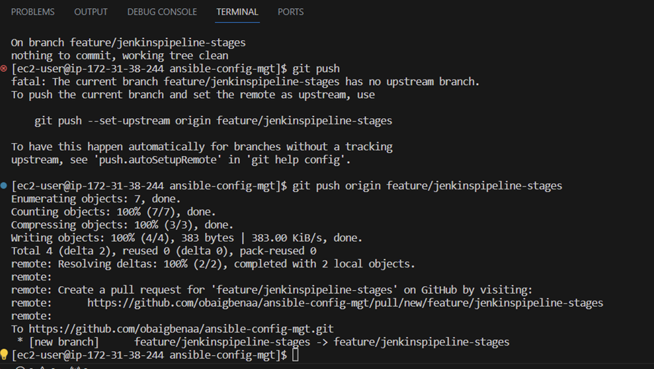
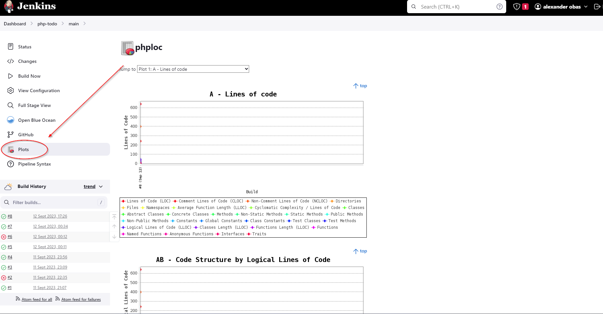
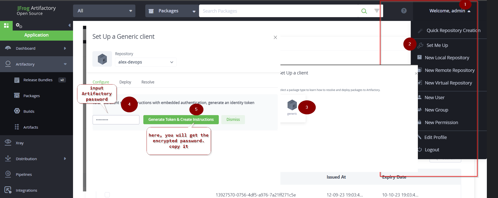

## Project-14

## CONTINUOUS INTEGRATION WITH JENKINS, ANSIBLE, ARTIFACTORY, SONARQUBE, PHP

## SIMULATING A TYPICAL CI/CD PIPELINE FOR A PHP-BASED APPLICATION

**Project Description:**

In this project, we will be setting up a CI/CD Pipeline for a PHP-based application. The overall CI/CD process looks like the architecture below:


This project is architected in two major repositories with each repository containing its own CI/CD pipeline written in a Jenkinsfile.

**“ansible-config-mgt” REPO**: this repository contains JenkinsFile which is responsible for setting up and configuring the infrastructure required to carry out processes required for our application to run. It does this through the use of ansible roles. This repo is infrastructure specific.

**“PHP-todo REPO”:** This repository contains Jenkinsfile which is focused on processes that are application build specific such as building, linting, static code analysis, push to artifact repository, etc.


### Prerequisites

We will be making use of AWS virtual machines for this and will require 6 servers for the project which include:

**Nginx Server:** This would act as the reverse proxy server to our site and tool.

**Jenkins server:** To be used to implement your CI/CD workflows or pipelines. Select a t2.medium at least, Ubuntu 20.04 and Security group should be open to port 8080

**SonarQube server:** To be used for Code quality analysis. Select a t2.medium at least, Ubuntu 20.04 and Security group should be open to port 9000

**Artifactory server:** To be used as the binary repository where the outcome of your build process is stored. Select a t2.medium at least and the Security group should be open to port 8081

**Database server:** To serve as the database server for the Todo application

**Todo webserver:** To host the Todo web application.


### ANSIBLE ROLES FOR CI ENVIRONMENT

In addition to our already existing roles, we will go ahead and add two more roles to Ansible:


1.	[SonarQube](https://www.sonarqube.org). (Scroll down to the Sonarqube section to see instructions on how to set up and configure SonarQube manually)
1. [Artifactory](https://jfrog.com/artifactory).

**Why do we need SonarQube?**

SonarQube is an open-source platform developed by SonarSource for continuous inspection of code quality, it is used to perform automatic reviews with static analysis of code to detect bugs, code smells, and security vulnerabilities. Watch a short description here. There is a lot more hands-on work ahead with SonarQube and Jenkins. So, the purpose of SonarQube will be clearer to you very soon.

**Why do we need Artifactory?**

Artifactory is a product by JFrog that serves as a binary repository manager. The binary repository is a natural extension to the source code repository, in that the outcome of your build process is stored. It can be used for certain other automation, but we will use it strictly to manage our build artifacts.

### Configuring Ansible for Jenkins Deployment

In previous projects, we have been launching Ansible commands manually from a CLI. Now, with Jenkins, we will start running Ansible from the Jenkins user interface (UI).

To do this, navigate to Jenkins URL, Install & Open Blue Ocean Jenkins Plugin


*Create a new Pipeline*


*Login to GitHub & Generate an Access Token*


At this point we do not have a [Jenkinsfile](https://www.jenkins.io/doc/book/pipeline/jenkinsfile/) in the Ansible repository, so Blue Ocean will attempt to give us some guidance to create one. But we do not need that. We will rather create one ourselves. So, click on Administration (as seen above) to exit the Blue Ocean console.


We will see here, our newly created pipeline which takes the name of our GitHub repository **“ansible-config-mgt”.**


### We will now create our Jenkinsfile

Inside the Ansible project, create a new directory ***deploy*** and start a new file ***Jenkinsfile*** inside the directory.

Add the code snippet below to start building the Jenkinsfile gradually. 

This pipeline currently has just one stage called Build and the only thing we are doing is using the shell script module to echo Building Stage. 

```
pipeline {
    agent any

  stages {
    stage('Build') {
      steps {
        script {
          sh 'echo "Building Stage"'
        }
      }
    }
    }
}
```
Add and push to github.


Now we go back into the Ansible pipeline in Jenkins and select configure.


Click “Apply” and “Save”. This will trigger a build and we will be able to see the effect of our basic Jenkinsfile configuration by going through the console output of the build. Now you will see that a build takes place with success.


To really appreciate and feel the difference of Cloud Blue UI, it is recommended that we try triggering the build again from Blue Ocean interface.

1.	Click on **Blue Ocean**
1.	Select the project **“ansible-config-mgt”**


Notice that this pipeline is a multibranch one. This means, if there were more than one branch in GitHub, Jenkins would have scanned the repository to discover them all and we would have been able to trigger a build for each branch.

To see this in action,
1.	We will create a new git branch and name it ***feature/jenkinspipeline-stages***


2. Currently we only have the Build stage. We will add another stage called ***Test***. Paste the code snippet below and push the new changes to GitHub.

```
pipeline {
    agent any

  stages {
    stage('Build') {
      steps {
        script {
          sh 'echo "Building Stage"'
        }
      }
    }

    stage('Test') {
      steps {
        script {
          sh 'echo "Testing Stage"'
        }
      }
    }
    }
}

```
```
$ git add .
$ git commit -m "added test stage"
$ git push origin feature/jenkinspipeline-stages
```



To make your new branch show up in Jenkins, we need to tell Jenkins to scan the repository.

-	Click on the "Administration" button.
-	Navigate to the Ansible project and click on "Scan repository now"


-	Refresh the page and both branches will start building automatically. You can go into Blue Ocean and see both branches there too.


In Blue Ocean, you can now see how the Jenkinsfile has caused a new step in the pipeline launch build for the new branch.


Go to GitHub, create pull request, and merge to main branch.


 After merging the PR, go back into your terminal and switch into the main branch, pull the latest change.

 Following the same sequence above, we will create a new branch, add more stages into the Jenkins file to simulate below phases. (Just add an echo command like we have in build and test stages)
   1. Package 
   1. Deploy 
   1. Clean up

Dont forget we have to update the jenkinsfile for all stages.

When all stages are now created, it should look like below.


### RUNNING ANSIBLE PLAYBOOK FROM JENKINS

Now that we have a broad overview of a typical Jenkins pipeline. Let us get the actual Ansible deployment to work by:
-	Installing Ansible on Jenkins
-	Installing Ansible plugin in Jenkins UI
-	Creating Jenkinsfile from scratch. (Delete all currently in the Jenkinsfile and start all over to get Ansible to run successfully). 

Ensure that Ansible runs against the Dev environment successfully.

*Install Ansible plugin*


click on ***“configure tools”***, scroll down to and input any name of your choice on the ***“ansible Name”*** section,
input path to ansible name directory ***/usr/bin/*** (this can be gotten if run the command ansible -–version on the Jenkins instance CLI) 


Add the following code to the jenkinsfile

```
pipeline {
  agent any
  
  environment {
      ANSIBLE_CONFIG="${WORKSPACE}/deploy/ansible.cfg"
    }

  stages{
    stage("Initial cleanup") {
          steps {
            dir("${WORKSPACE}") {
              deleteDir()
            }
          }
        }

      stage('Checkout SCM') {
         steps{
            git branch: 'main', url: 'https://github.com/obaigbenaa/ansible-config-mgt.git'
         }
       }

      stage('Prepare Ansible For Execution') {
        steps {
          sh 'echo ${WORKSPACE}' 
          sh 'sed -i "3 a roles_path=${WORKSPACE}/roles" ${WORKSPACE}/deploy/ansible.cfg'  
        }
     }

      stage('Run Ansible playbook') {
        steps {
           ansiblePlaybook become: true, colorized: true, credentialsId: 'jenkins-key', disableHostKeyChecking: true, installation: 'ansible', inventory: 'inventory/dev.yml', playbook: 'playbooks/site.yml'
         }
      }

      stage('Clean Workspace after build'){
        steps{
          cleanWs(cleanWhenAborted: true, cleanWhenFailure: true, cleanWhenNotBuilt: true, cleanWhenUnstable: true, deleteDirs: true)
        }
      }
   }

}
```

**Some possible errors to watch out for:**

1. Ensure that the git module in Jenkinsfile is checking out SCM to *main* branch instead of *master* (GitHub has discontinued the use of *Master*)

1. Jenkins needs to export the ANSIBLE_CONFIG environment variable. You can put the *.ansible.cfg* file alongside Jenkinsfile in the deploy directory. This way, anyone can easily identify that everything in there relates to deployment. Then, using the ***Pipeline Syntax*** tool in Ansible, generate the syntax to create environment variables to set. Enter this into the *ancible.cfg* file

>ansible.cfg

```
timeout = 160
callback_whitelist = profile_tasks
log_path=~/ansible.log
host_key_checking = False
gathering = smart
ansible_python_interpreter=/usr/bin/python3
allow_world_readable_tmpfiles=true


[ssh_connection]
ssh_args = -o ControlMaster=auto -o ControlPersist=30m -o ControlPath=/tmp/ansible-ssh-%h-%p-%r -o ServerAliveInterval=60 -o ServerAliveCountMax=60 -o ForwardAgent=yes
```


3. Remember that ansible.cfg must be exported to the environment variable so that Ansible knows where to find Roles. But because you will possibly run Jenkins from different git branches, the location of Ansible roles will change. Therefore, you must handle this dynamically. You can use Linux Stream Editor sed to update the section roles_path each time there is an execution. You may not have this issue if you run only from the main branch.

1. If you push new changes to Git so that Jenkins failure can be fixed. You might observe that your change may sometimes have no effect. Even though your change is the actual fix required. This can be because Jenkins did not download the latest code from GitHub. Ensure that you start the Jenkinsfile with a clean-up step to always delete the previous workspace before running a new one. Sometimes you might need to log in to the Jenkins Linux server to verify the files in the workspace to confirm that what you are actually expecting is there. Otherwise, you can spend hours trying to figure out why Jenkins is still failing, when you have pushed up possible changes to fix the error.

1. Another possible reason for Jenkins failure sometimes, is because you have indicated in the Jenkinsfile to check out the main git branch, and you are running a pipeline from another branch. So, always verify by logging onto the Jenkins box to check the workspace, and run *git branch* command to confirm that the branch you are expecting is there.

**Note:** We will note that since we are trying to run the playbook from Jenkins, Jenkins will need to SSH into the instance. The only way Jenkins can “talk to” the instance is by updating the instance credentials (private key) unto Jenkins.

To do this, go to Jenkins UI and follow the steps below


"Add" and "Create" 

To generate our pipeline script (individual ansible-playbook command), go back to dashboard, ansible-config-mgt, and click on pipeline syntax.


Update pipeline syntax in Jenkinsfile.

Now scan the repository.

This will perform an ***initial cleanup, checkout SCM, prepare ansible for execution, run ansible-playbook and clean workspace after build***.


> Our Dev environment now has an up-to-date configuration. But what if we need to deploy to other environments?
>
>Manually updating the Jenkins file is definitely not an option. The aim is to try to automate things as much as possible.


### Parameterizing Jenkinsfile For Ansible Deployment. 

So far we have been deploying to dev environment, what if we need to deploy to other environments? We will use parameterization so that at the point of execution, the appropriate values are applied. 
To parameterize Jenkinsfile For Ansible deployment, 

1. Update CI inventory with new servers.

```
[tooling]
<SIT-Tooling-Web-Server-Private-IP-Address>

[todo]
<SIT-Todo-Web-Server-Private-IP-Address>

[nginx]
<SIT-Nginx-Private-IP-Address>

[db:vars]
ansible_user=ec2-user
ansible_python_interpreter=/usr/bin/python

[db]
<SIT-DB-Server-Private-IP-Address>
```

2. Update Jenkinsfile to introduce parameterization. Below is just one parameter. It has a default value in case if no value is specified at execution. It also has a description so that everyone is aware of its purpose.

```
pipeline {
    agent any

    parameters {
      string(name: 'inventory', defaultValue: 'dev',  description: 'This is the inventory file for the environment to deploy configuration')
    }
```

3. In the Ansible execution section, remove the hardcoded inventory/dev and replace with ``` ${inventory} ```


From now on, each time you hit on execute, it will expect an input. But notice that the default value uploads.


hit "build" to see confirm it runs.


## CI/CD PIPELINE FOR TODO APPLICATION

Here, we will introduce another PHP application to add to the list of software products we are managing in our infrastructure. The good thing with this particular application is that it has unit tests, and it is an ideal application to show an end-to-end CI/CD pipeline for a particular application.

Our goal here is to deploy the PHP application onto servers directly from ```Artifactory``` rather than from ```git```.
* Update Ansible with an ***Artifactory role***. You can install an Artifcatory role using the ansible galaxy community repository in the roles directory.


## Phase 1 – Prepare Jenkins
#

1. Install git and fork the below code repository into your github account

> https://github.com/darey-devops/php-todo.git

2. On your Jenkins server, install PHP, its dependencies and  [Composer tool](https://getcomposer.org/)

### Dependencies to be installed
=========

- sudo yum install -y https://dl.fedoraproject.org/pub/epel/epel-release-latest-8.noarch.rpm
- sudo yum install -y dnf-utils http://rpms.remirepo.net/enterprise/remi-release-8.rpm
- sudo yum install python3 python3-pip wget unzip git -y
- python3 -m pip install --upgrade setuptools
- python3 -m pip install --upgrade pip
- python3 -m pip install PyMySQL
- python3 -m pip install mysql-connector-python
- python3 -m pip install psycopg2==2.7.5 --ignore-installed

#### Install Java
======

- sudo wget -O /etc/yum.repos.d/jenkins.repo \
    https://pkg.jenkins.io/redhat-stable/jenkins.repo
- sudo rpm --import https://pkg.jenkins.io/redhat-stable/jenkins.io-2023.key
- sudo yum upgrade

#Add required dependencies for the jenkins package
- sudo yum install java-17-openjdk
- sudo yum install jenkins
- sudo systemctl daemon-reload

#### open the bash profile 
- sudo vi .bash_profile

#### paste the below in the bash profile

export JAVA_HOME=$(dirname $(dirname $(readlink $(readlink $(which javac)))))
export PATH=$PATH:$JAVA_HOME/bin
export CLASSPATH=.:$JAVA_HOME/jre/lib:$JAVA_HOME/lib:$JAVA_HOME/lib/tools.jar

#### reload the bash profile
source ~/.bash_profile


#### *Install php*
=======
- sudo yum module reset php -y
- sudo yum module enable php:remi-7.4 -y
- sudo yum install -y php  php-common php-mbstring php-opcache php-intl php-xml php-gd php-curl php-mysqlnd    php-fpm php-json
- sudo systemctl start php-fpm
- sudo systemctl enable php-fpm


#### Ansible dependencies to install
=====================================

 #For Mysql Database
```
- ansible-galaxy collection install community.mysql
```

 #For Postgresql Database
```
ansible-galaxy collection install community.postgresql
``````

#### Install composer
=====================================
- curl -sS https://getcomposer.org/installer | php 
- sudo mv composer.phar /usr/bin/composer

#### Verify Composer is installed or not
- composer --version


#### Install phpunit, phploc
=====================================
- sudo dnf --enablerepo=remi install php-phpunit-phploc
- wget -O phpunit https://phar.phpunit.de/phpunit-7.phar
- chmod +x phpunit
- sudo yum  install php-xdebug
- Locate your php.ini file with your favourite text editor

sudo vi /etc/php.ini 

and search for the xdebug.mode setting. If it doesn't exist, you can add it to the [XDebug] section of the file to create it, if it does not exist.

Copy code

**xdebug.mode = coverage**

Save the php.ini file and close it.


*above, php is installed with Xdebug*.

Now, on Jenkins UI, Install the following plugins
1. Plot plugin - to be used to display tests reports, and code coverage information.

1. Artifactory plugin - to be used to easily upload code artifacts into an Artifactory server.


3. Provision a new instance based on RHEL **t2.medium**, to serve as the artifactory server. Set the inbound security rule to listen on port **8081** and **8082**.

Update *inventory/ci.yml* file with private IP address of artifactory 'host'

confirm all tasks and paths on *roles/artifactory/task/main.yml* as well as the *bash-profile.j2*

Update *playbooks/site.yml* to 'import' artifactory.yml

Now run the playbook against the **ci** environment


the pipeline should run including the playbook, which will install jfrog artifactory.


Add the artifactory server IP address to the JFROG global configuration. Configure the server ID, URL and Credentials, run Test Connection.


Create a GENERIC Repository called Alex (give it any name you prefer). This will be used to store our build artifacts


## Phase 2 – Integrate Artifactory repository with Jenkins
#

1. Create a dummy Jenkinsfile inside the php-todo repository *(derived from phase 1.1 above)*


1. On the mysql database server, create database and user

```
Create database homestead;
CREATE USER 'homestead'@'%' IDENTIFIED BY 'sePret^i';
GRANT ALL PRIVILEGES ON * . * TO 'homestead'@'%';
``````


git commit, push to branch and update *playbook/site.yml* with db assignmment and build the pipleline again.

confirm that mysql is installed on the host db and database and user created.

```
sudo mysql
SHOW DATABASES
``````


3. Using Blue Ocean, create a multibranch Jenkins pipeline


Install mysql client on the jenkins server: 

```
sudo yum install mysql -y
```
Login into the DB-server(mysql server) and set the the bind address to **0.0.0.0** 

```
sudo vi /etc/mysql/mysql.conf.d/mysqld.cnf
```


Note the MySQL ansible role will creat the database for the mysql server

4. In the Php-Todo repo, update the database connectivity requirements in the file *.env.sample*

1. Update Jenkinsfile with proper pipeline configuration and scan phd-todo repository

```
pipeline {
    agent any

  stages {

     stage("Initial cleanup") {
          steps {
            dir("${WORKSPACE}") {
              deleteDir()
            }
          }
        }

    stage('Checkout SCM') {
      steps {
            git branch: 'main', url: 'https://github.com/darey-devops/php-todo.git'
      }
    }

    stage('Prepare Dependencies') {
      steps {
             sh 'mv .env.sample .env'
             sh 'composer install'
             sh 'php artisan migrate'
             sh 'php artisan db:seed'
             sh 'php artisan key:generate'
      }
    }
  }
}
```


Notice the Prepare Dependencies section

The required file by PHP is .env so we are renaming .env.sample to .env
Composer is used by PHP to install all the dependent libraries used by the application
php artisan uses the .env file to setup the required database objects – (After successful run of this step, login to the database, run show tables and you will see the tables being created for you


#### Update the Jenkinsfile to include Unit tests step

    stage('Execute Unit Tests') {
      steps {
             sh './vendor/bin/phpunit'
      } 

#### note: *you may encounter an error at this point*


Locate your php.ini file: The location of the php.ini file with your favourite text editor

sudo vi /etc/php.ini 

Search for the xdebug.mode setting. If it doesn't exist, you can add it to the [XDebug] section of the file of create it if it does not exist.

*Copy code*

xdebug.mode = coverage

Save the php.ini file and close it.


## Phase 3 – Code Quality Analysis
#
For PHP the most commonly used tool for code quality analysis is [phploc](https://phpqa.io/projects/phploc.html). 

The data produced by phploc can be ploted onto graphs in Jenkins.

1. Add the ***code analysis*** step in Jenkinsfile. 
The output of the data will be saved in *build/logs/phploc.csv* file

```
stage('Code Analysis') {
  steps {
        sh 'phploc app/ --log-csv build/logs/phploc.csv'

  }
}
```
2. Plot the data set below using the Jenkins **plot** plugin. 
(This plugin provides generic plotting (or graphing) capabilities in Jenkins. It will plot one or more single values variations across builds in one or more plots.) already installed.  

Now add below stage to php-todo Jenkinsfile.

```
stage('Plot Code Coverage Report') {
      steps {

            plot csvFileName: 'plot-396c4a6b-b573-41e5-85d8-73613b2ffffb.csv', csvSeries: [[displayTableFlag: false, exclusionValues: 'Lines of Code (LOC),Comment Lines of Code (CLOC),Non-Comment Lines of Code (NCLOC),Logical Lines of Code (LLOC)                          ', file: 'build/logs/phploc.csv', inclusionFlag: 'INCLUDE_BY_STRING', url: '']], group: 'phploc', numBuilds: '100', style: 'line', title: 'A - Lines of code', yaxis: 'Lines of Code'
            plot csvFileName: 'plot-396c4a6b-b573-41e5-85d8-73613b2ffffb.csv', csvSeries: [[displayTableFlag: false, exclusionValues: 'Directories,Files,Namespaces', file: 'build/logs/phploc.csv', inclusionFlag: 'INCLUDE_BY_STRING', url: '']], group: 'phploc', numBuilds: '100', style: 'line', title: 'B - Structures Containers', yaxis: 'Count'
            plot csvFileName: 'plot-396c4a6b-b573-41e5-85d8-73613b2ffffb.csv', csvSeries: [[displayTableFlag: false, exclusionValues: 'Average Class Length (LLOC),Average Method Length (LLOC),Average Function Length (LLOC)', file: 'build/logs/phploc.csv', inclusionFlag: 'INCLUDE_BY_STRING', url: '']], group: 'phploc', numBuilds: '100', style: 'line', title: 'C - Average Length', yaxis: 'Average Lines of Code'
            plot csvFileName: 'plot-396c4a6b-b573-41e5-85d8-73613b2ffffb.csv', csvSeries: [[displayTableFlag: false, exclusionValues: 'Cyclomatic Complexity / Lines of Code,Cyclomatic Complexity / Number of Methods ', file: 'build/logs/phploc.csv', inclusionFlag: 'INCLUDE_BY_STRING', url: '']], group: 'phploc', numBuilds: '100', style: 'line', title: 'D - Relative Cyclomatic Complexity', yaxis: 'Cyclomatic Complexity by Structure'      
            plot csvFileName: 'plot-396c4a6b-b573-41e5-85d8-73613b2ffffb.csv', csvSeries: [[displayTableFlag: false, exclusionValues: 'Classes,Abstract Classes,Concrete Classes', file: 'build/logs/phploc.csv', inclusionFlag: 'INCLUDE_BY_STRING', url: '']], group: 'phploc', numBuilds: '100', style: 'line', title: 'E - Types of Classes', yaxis: 'Count'
            plot csvFileName: 'plot-396c4a6b-b573-41e5-85d8-73613b2ffffb.csv', csvSeries: [[displayTableFlag: false, exclusionValues: 'Methods,Non-Static Methods,Static Methods,Public Methods,Non-Public Methods', file: 'build/logs/phploc.csv', inclusionFlag: 'INCLUDE_BY_STRING', url: '']], group: 'phploc', numBuilds: '100', style: 'line', title: 'F - Types of Methods', yaxis: 'Count'
            plot csvFileName: 'plot-396c4a6b-b573-41e5-85d8-73613b2ffffb.csv', csvSeries: [[displayTableFlag: false, exclusionValues: 'Constants,Global Constants,Class Constants', file: 'build/logs/phploc.csv', inclusionFlag: 'INCLUDE_BY_STRING', url: '']], group: 'phploc', numBuilds: '100', style: 'line', title: 'G - Types of Constants', yaxis: 'Count'
            plot csvFileName: 'plot-396c4a6b-b573-41e5-85d8-73613b2ffffb.csv', csvSeries: [[displayTableFlag: false, exclusionValues: 'Test Classes,Test Methods', file: 'build/logs/phploc.csv', inclusionFlag: 'INCLUDE_BY_STRING', url: '']], group: 'phploc', numBuilds: '100', style: 'line', title: 'I - Testing', yaxis: 'Count'
            plot csvFileName: 'plot-396c4a6b-b573-41e5-85d8-73613b2ffffb.csv', csvSeries: [[displayTableFlag: false, exclusionValues: 'Logical Lines of Code (LLOC),Classes Length (LLOC),Functions Length (LLOC),LLOC outside functions or classes ', file: 'build/logs/phploc.csv', inclusionFlag: 'INCLUDE_BY_STRING', url: '']], group: 'phploc', numBuilds: '100', style: 'line', title: 'AB - Code Structure by Logical Lines of Code', yaxis: 'Logical Lines of Code'
            plot csvFileName: 'plot-396c4a6b-b573-41e5-85d8-73613b2ffffb.csv', csvSeries: [[displayTableFlag: false, exclusionValues: 'Functions,Named Functions,Anonymous Functions', file: 'build/logs/phploc.csv', inclusionFlag: 'INCLUDE_BY_STRING', url: '']], group: 'phploc', numBuilds: '100', style: 'line', title: 'H - Types of Functions', yaxis: 'Count'
            plot csvFileName: 'plot-396c4a6b-b573-41e5-85d8-73613b2ffffb.csv', csvSeries: [[displayTableFlag: false, exclusionValues: 'Interfaces,Traits,Classes,Methods,Functions,Constants', file: 'build/logs/phploc.csv', inclusionFlag: 'INCLUDE_BY_STRING', url: '']], group: 'phploc', numBuilds: '100', style: 'line', title: 'BB - Structure Objects', yaxis: 'Count'

      }
    }
```

Push code to Githug and scan repository.


You should now see a Plot menu item on the left menu. Click on it to see the charts.



3. Bundle the application code for into an artifact (archived package) and upload to Artifactory

sudo yum install zip -y

update Jenkinsfile with code below

```
stage ('Package Artifact') {
    steps {
            sh 'zip -qr php-todo.zip ${WORKSPACE}/*'
     }
    }
```

4. Publish the resulting artifact into Artifactory pipeline

```
stage ('Upload Artifact to Artifactory') {
          steps {
            script { 
                 def server = Artifactory.server 'Artifactory'                 
                 def uploadSpec = """{
                    "files": [
                      {
                       "pattern": "php-todo.zip",
                       "target": "<name-of-artifactory-repository>/php-todo",
                       "props": "type=zip;status=ready"

                       }
                    ]
                 }""" 

                 server.upload spec: uploadSpec
               }
            }

        }
```


Check Artifactory dashboard, you will see php-todo artifact under the artifacts session.


5. Deploy the application to the dev environment by launching Ansible pipeline

Update php-todo jenkinsfile with code below:

```
stage ('Deploy to Dev Environment') {
    steps {
    build job: 'ansible-config-mgt/main', parameters: [[$class: 'StringParameterValue', name: 'env', value: 'dev']], propagate: false, wait: true
    }
  }
```
The build job used in this step tells Jenkins to start another job. In this case it is the ansible-config-mgt job, and we are targeting the main branch. Hence, we have ansible-config-mgt/main. 
Since the ansible-config-mgt requires parameters to be passed in, we have included this by specifying the parameters section. The name of the parameter is env and its value is dev. Meaning, deploy to the Development environment.


create a tooling server and update *inventory/dev.yml* with *todo* server private IP address

Create *deployment.yml* file in the static assignment folder

and input the data below

```
---
- name: Deploying the PHP Applicaion to Dev Enviroment
  become: true
  hosts: todo

  tasks:
    - name: install remi and rhel repo
      ansible.builtin.yum:
        name:
          - https://dl.fedoraproject.org/pub/epel/epel-release-latest-8.noarch.rpm
          - dnf-utils
          - http://rpms.remirepo.net/enterprise/remi-release-8.rpm
        disable_gpg_check: yes

    - name: install httpd on the webserver
      ansible.builtin.yum:
        name: httpd
        state: present

    - name: ensure httpd is started and enabled
      ansible.builtin.service:
        name: httpd
        state: started
        enabled: yes

    - name: install PHP
      ansible.builtin.yum:
        name:
          - php
          - php-mysqlnd
          - php-gd
          - php-curl
          - unzip
          - php-common
          - php-mbstring
          - php-opcache
          - php-intl
          - php-xml
          - php-fpm
          - php-json
        enablerepo: php:remi-7.4
        state: present

    - name: ensure php-fpm is started and enabled
      ansible.builtin.service:
        name: php-fpm
        state: started
        enabled: yes

    - name: Download the artifact
      get_url:
        url: <your-artifactory-repo-url>
        dest: /home/ec2-user/
        url_username: admin
        url_password: <encrypted-Password>

    - name: unzip the artifacts
      ansible.builtin.unarchive:
        src: /home/ec2-user/php-todo
        dest: /home/ec2-user/
        remote_src: yes

    - name: deploy the code
      ansible.builtin.copy:
        src: /home/ec2-user/var/lib/jenkins/workspace/php-todo_main/
        dest: /var/www/html/
        force: yes
        remote_src: yes

    - name: remove nginx default page
      ansible.builtin.file:
        path: /etc/httpd/conf.d/welcome.conf
        state: absent

    - name: restart httpd
      ansible.builtin.service:
        name: httpd
        state: restarted
```

see how to generate encrypted password in image below:



update playbooks/site/yml to import playbook static-assignments/deployment.yml

scan php-todo repository

you will see that ansible-config-mgt pipeline has been triggered from php-todo


Even though we have implemented Unit Tests and Code Coverage Analysis with phpunit and phploc, we still need to implement Quality Gate to ensure that ONLY code with the required code coverage, and other quality standards make it through to the environments.

To achieve this, we need to configure SonarQube


### Install SonarQube on Ubuntu 22.04 LTS

- Tune Linux Kernel

This can be achieved by making session changes which does not persist beyond the current session terminal.

```
sudo sysctl -w vm.max_map_count=524288
sudo sysctl -w fs.file-max=131072
ulimit -n 131072
ulimit -u 8192
```

To make a permanent change, edit the file /etc/security/limits.conf and append the below

sonarqube   -   nofile   65536
sonarqube   -   nproc    4096

Install wget and unzip packages

```
sudo apt-get install wget unzip -y

sudo apt update

```
Install OpenJDK and Java Runtime Environment(JRE) 11

```
sudo apt-get install openjdk-11-jdk -y
sudo apt-get install openjdk-11-jre -y

```
Set default JDK – To set default JDK or switch to OpenJDK enter below command:

```
sudo update-alternatives --config java

```
Verify the set JAVA Version:
```
java -version
```
Install and Setup PostgreSQL 10 Database for SonarQube

The command below will add PostgreSQL repo to the repo list:
```
sudo sh -c 'echo "deb http://apt.postgresql.org/pub/repos/apt/ `lsb_release -cs`-pgdg main" >> /etc/apt/sources.list.d/pgdg.list'
```

Download PostgreSQL software
```
wget -q https://www.postgresql.org/media/keys/ACCC4CF8.asc -O - | sudo apt-key add -
```
you shoulld get a response "OK"

Install PostgreSQL Database Server
```
sudo apt-get -y install postgresql postgresql-contrib
```

Start PostgreSQL Database Server

```
sudo systemctl start postgresql
sudo systemctl status postgresql
```

Change the password for default postgres user (input the password you intend to use, and remember to save it somewhere)

```
sudo passwd postgres
```

Switch to the postgres user

```
su - postgres
```

Create a new user by typing:
```
createuser sonar
```

Switch to the PostgreSQL shell

```
psql
```

Set a password for the newly created user for SonarQube database

```
ALTER USER sonar WITH ENCRYPTED password 'sonar';
```
Create a new database for PostgreSQL database by running:

```
CREATE DATABASE sonarqube OWNER sonar;
```
Grant all privileges to sonar user on sonarqube Database.

```
GRANT ALL PRIVILEGES ON DATABASE sonarqube TO sonar;
```
Exit from the psql shell:
```
\q
```

Switch back to the sudo user by running the exit command

Exit

#### *Install SonarQube on Ubuntu 22.04 LTS*

Navigate to the tmp directory to temporarily download the installation files

```
cd /tmp 

sudo wget https://binaries.sonarsource.com/Distribution/sonarqube/sonarqube-7.9.3.zip
```
Unzip the archive setup to /opt directory

```
sudo unzip sonarqube-7.9.3.zip -d /opt
```

Move extracted setup to /opt/sonarqube directory

```
sudo mv /opt/sonarqube-7.9.3 /opt/sonarqube
```

#### CONFIGURE SONARQUBE

We cannot run SonarQube as a root user, if you run using root user it will stop automatically. The ideal approach will be to create a separate group and a user to run SonarQube

Create a group sonar
```
sudo groupadd sonar
```
Now add a user with control over the /opt/sonarqube directory and change ownership

```
 sudo useradd -c "user to run SonarQube" -d /opt/sonarqube -g sonar sonar 
 sudo chown sonar:sonar /opt/sonarqube -R
```

Open SonarQube configuration file using your favourite text editor (e.g., nano or vim)

sudo vim /opt/sonarqube/conf/sonar.properties

Find the following lines:

#sonar.jdbc.username=
#sonar.jdbc.password=

Uncomment them and provide the values of PostgreSQL Database username and password you chose:
```
#--------------------------------------------------------------------------------------------------

# DATABASE

#

# IMPORTANT:

# - The embedded H2 database is used by default. It is recommended for tests but not for

#   production use. Supported databases are Oracle, PostgreSQL and Microsoft SQLServer.

# - Changes to database connection URL (sonar.jdbc.url) can affect SonarSource licensed products.

# User credentials.

# Permissions to create tables, indices and triggers must be granted to JDBC user.

# The schema must be created first.

sonar.jdbc.username=sonar
sonar.jdbc.password=sonar

#----- PostgreSQL 9.3 or greater
# By default the schema named "public" is used. It can be overridden with the parameter "currentSchema".

sonar.jdbc.url=jdbc:postgresql://localhost:5432/sonarqube
```


Edit the sonar script file and set RUN_AS_USER

sudo vi /opt/sonarqube/bin/linux-x86-64/sonar.sh

```
# If specified, the Wrapper will be run as the specified user.

# IMPORTANT - Make sure that the user has the required privileges to write

#  the PID file and wrapper.log files.  Failure to be able to write the log

#  file will cause the Wrapper to exit without any way to write out an error

#  message.

# NOTE - This will set the user which is used to run the Wrapper as well as

#  the JVM and is not useful in situations where a privileged resource or

#  port needs to be allocated prior to the user being changed.

RUN_AS_USER=sonar
```

Now, to start SonarQube we need to do following:

Switch to sonar user

sudo su – sonar

cd /opt/sonarqube/bin/linux-x86-64/

Run the script to start SonarQube

./sonar.sh start

Expected output shall be as:
```
Starting SonarQube...

Started SonarQube
```
Check SonarQube running status:

./sonar.sh status

Sample Output below:

```
./sonar.sh status

SonarQube is running (9570).
```

To check SonarQube logs, navigate to */opt/sonarqube/logs/sonar.log* directory
```
tail /opt/sonarqube/logs/sonar.log
```
Output
```
2023.08.24 00:24:21 INFO  app[][o.s.a.SchedulerImpl] Waiting for Elasticsearch to be up and running
OpenJDK 64-Bit Server VM warning: Option UseConcMarkSweepGC was deprecated in version 9.0 and will likely be removed in a future release.
2023.08.24 00:24:21 INFO  app[][o.e.p.PluginsService] no modules loaded
2023.08.24 00:24:21 INFO  app[][o.e.p.PluginsService] loaded plugin [org.elasticsearch.transport.Netty4Plugin]
2023.08.24 00:24:31 INFO  app[][o.s.a.SchedulerImpl] Process[es] is up
2023.08.24 00:24:31 INFO  app[][o.s.a.ProcessLauncherImpl] Launch process[[key='web', ipcIndex=2, logFilenamePrefix=web]] from [/opt/sonarqube]: /usr/lib/jvm/java-11-openjdk-amd64/bin/java -Djava.awt.headless=true -Dfile.encoding=UTF-8 -Djava.io.tmpdir=/opt/sonarqube/temp --add-opens=java.base/java.util=ALL-UNNAMED --add-opens=java.base/java.lang=ALL-UNNAMED --add-opens=java.base/java.io=ALL-UNNAMED --add-opens=java.rmi/sun.rmi.transport=ALL-UNNAMED -Xmx512m -Xms128m -XX:+HeapDumpOnOutOfMemoryError -Dhttp.nonProxyHosts=localhost|127.*|[::1] -cp ./lib/common/*:/opt/sonarqube/lib/jdbc/h2/h2-1.3.176.jar org.sonar.server.app.WebServer /opt/sonarqube/temp/sq-process4520644032936249784properties
2023.08.24 00:25:18 INFO  app[][o.s.a.SchedulerImpl] Process[web] is up
2023.08.24 00:25:18 INFO  app[][o.s.a.ProcessLauncherImpl] Launch process[[key='ce', ipcIndex=3, logFilenamePrefix=ce]] from [/opt/sonarqube]: /usr/lib/jvm/java-11-openjdk-amd64/bin/java -Djava.awt.headless=true -Dfile.encoding=UTF-8 -Djava.io.tmpdir=/opt/sonarqube/temp --add-opens=java.base/java.util=ALL-UNNAMED -Xmx512m -Xms128m -XX:+HeapDumpOnOutOfMemoryError -Dhttp.nonProxyHosts=localhost|127.*|[::1] -cp ./lib/common/*:/opt/sonarqube/lib/jdbc/h2/h2-1.3.176.jar org.sonar.ce.app.CeServer /opt/sonarqube/temp/sq-process17236995486640882659properties
2023.08.24 00:25:23 INFO  app[][o.s.a.SchedulerImpl] Process[ce] is up
2023.08.24 00:25:23 INFO  app[][o.s.a.SchedulerImpl] SonarQube is up
```


You can see that SonarQube is up and running.

#### Configure SonarQube to run as a systemd service

Stop the currently running SonarQube service

```
cd /opt/sonarqube/bin/linux-x86-64/
```
Run the script to stop SonarQube

```
sudo ./sonar.sh stop
```

```
Gracefully stopping SonarQube...
Stopped SonarQube.
```

#### *Create a systemd service file for SonarQube to run as System Startup.*

```
sudo vi /etc/systemd/system/sonar.service
```

Add the configuration below for systemd to determine how to start, stop, check status, or restart the SonarQube service.

```
[Unit]
Description=SonarQube service
After=syslog.target network.target

[Service]
Type=forking

ExecStart=/opt/sonarqube/bin/linux-x86-64/sonar.sh start
ExecStop=/opt/sonarqube/bin/linux-x86-64/sonar.sh stop

User=sonar
Group=sonar
Restart=always

LimitNOFILE=65536
LimitNPROC=4096

[Install]
WantedBy=multi-user.target
```

Save the file and control the service with systemctl

```
sudo systemctl start sonar
sudo systemctl enable sonar
sudo systemctl status sonar
```

Access SonarQube

To access SonarQube using browser, type server’s IP address followed by port 9000

http://server_IP:9000 OR http://localhost:9000


### CONFIGURE SONARQUBE AND JENKINS FOR QUALITY GATE
 
In Jenkins, install SonarQube Scanner plugin

Navigate to configure system in Jenkins. Add SonarQube server as shown below:

 - Manage Jenkins > Configure System

 

 Generate authentication token in SonarQube

 

 Configure Quality Gate Jenkins Webhook in SonarQube – The URL should point to your Jenkins server *http://{jenkins-IP:8080}/sonarqube-webhook/*

 

 Setup SonarQube scanner from Jenkins – Global Tool Configuration

 

#### Update Jenkins Pipeline to include SonarQube scanning and Quality Gate

Below is the snippet for a Quality Gate stage in Jenkinsfile of the Todo repository.

it may be advisible to input the code snipet before the "Package Artifact" stage

```
stage('SonarQube Quality Gate') {
        environment {
            scannerHome = tool 'sonarqubescanner'
        }
        steps {
            withSonarQubeEnv('sonarqube') {
                sh "${scannerHome}/bin/sonar-scanner"
            }

        }
    }
```

#### *Update sonar-scanner.properties*

cd /var/lib/jenkins/tools/hudson.plugins.sonar.SonarRunnerInstallation/sonarqubescanner/conf/

Open *sonar-scanner.properties* file

```
sudo vi sonar-scanner.properties
```
Add configuration related to *php-todo* project

sonar.host.url=http://<SonarQube-Server-IP-address>:9000
sonar.projectKey=php-todo
#----- Default source code encoding
sonar.sourceEncoding=UTF-8
sonar.php.exclusions=**/vendor/**
sonar.php.coverage.reportPaths=build/logs/clover.xml
sonar.php.tests.reportPath=build/logs/junit.xml
sonar.login=<your_user_token>


update the github repo and run the pipeline.


### End-to-End Pipeline Overview

If everything has worked out for you so far, you should have a view like below:


The quality gate we just included has no effect because if you go to the SonarQube UI, you will realise that we just pushed a poor-quality code onto the development environment.

Navigate to php-todo project in SonarQube


There are bugs, and there is 13.7% code coverage. (code coverage is a percentage of unit tests added by developers to test functions and objects in the code)

If you click on php-todo project for further analysis, you will see that there is 20 days’ worth of technical debt, aprox. 2000 code smells and security issues in the code.


A measure of "20 days' worth of technical debt" reported by SonarQube indicates a substantial amount of accumulated issues and code quality problems in your software project. This metric suggests that it would take approximately 20 days of developer effort to address the identified technical debt and bring the codebase to a higher level of quality.

 While it may seem daunting, it's crucial to address technical debt systematically and continuously. By doing so, you can enhance the maintainability, reliability, and overall quality of your software over time.

 Assuming a basic gitflow implementation restricts only the develop branch to deploy code to Integration environment like sit.

Let us update our Jenkinsfile to implement this:

* First, we will include a When condition to run Quality Gate whenever the running branch is either develop, hotfix, release, main, or master

```
when { branch pattern: "^develop*|^hotfix*|^release*|^main*", comparator: "REGEXP"}
```
* Then we add a timeout step to wait for SonarQube to complete analysis and successfully finish the pipeline only when code quality is acceptable.

```
timeout(time: 1, unit: 'MINUTES') {
        waitForQualityGate abortPipeline: true
    }
```
The complete "SonarQube Quality Gate" stage will now look like this:

```
stage('SonarQube Quality Gate') {
      when { branch pattern: "^develop*|^hotfix*|^release*|^main*", comparator: "REGEXP"}
        environment {
            scannerHome = tool 'SonarQubeScanner'
        }
        steps {
            withSonarQubeEnv('sonarqube') {
                sh "${scannerHome}/bin/sonar-scanner -Dproject.settings=sonar-project.properties"
            }
            timeout(time: 1, unit: 'MINUTES') {
                waitForQualityGate abortPipeline: true
            }
        }
    }

```

To test, we create different branches and push to GitHub. You will realise that only branches other than develop, hotfix, release, main, or master will be able to deploy the code.


Notice that with the current state of the code, it cannot be deployed to Integration environments due to its quality. In the real world, DevOps engineers will push this back to developers to work on the code further, based on SonarQube quality report. Once everything is good with code quality, the pipeline will pass and proceed with sipping the codes further to a higher environment

## Configure Jenkins Slave

To introduce Jenkins slaves and configure Jenkins to run pipeline jobs randomly on any available slave nodes, as well as set up a webhook between Jenkins and GitHub to automatically trigger the pipeline on code push, and deploy the application to multiple environments, follow these steps:

* Provision an additional RHEL server (t2-micro will do) that will serve as Jenkins slave. 

* Install Java

```
sudo yum install java-11-openjdk-devel -y
```
* Update bash profile

```
sudo vi .bash_profile with the file below
```

```
export JAVA_HOME=$(dirname $(dirname $(readlink $(readlink $(which java)))))
export PATH=$PATH:$JAVA_HOME/bin 
export CLASSPATH=.:$JAVA_HOME/jre/lib:$JAVA_HOME/lib:$JAVA_HOME/lib/tools.jar
```
Reload the bash profile

```
source ~/.bash_profile
```

* Create and configure jenkins-slave node


